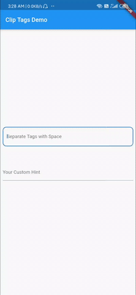

# flutter_chip_tags

flutter_chip_tags allow developers to create tags from list and add or remove tags from list. It has a TextFormField where user can insert value and it will seprate each tag by space. Similar to GitHub Manage Topics

## Getting Started

## For Detailed Example head over to [example/lib/main.dart](example/lib/main.dart)

## Sample

```dart
ChipTags(
  list: _myListCustom,
  chipColor: Colors.black,
  iconColor: Colors.white,
  textColor: Colors.white,
  decoration: InputDecoration(hintText: "Your Custom Hint"),
  keyboardType: TextInputType.text,
),
```

## Properties

| Property          | Function                                              |
| ----------------- | ----------------------------------------------------- |
| list              | `List<String>` which you want to display as Tags.     |
| chipColor         | Sets Chip background color. By default it's Blue.     |
| iconColor         | Sets Icon color. By default it's White.               |
| textColor         | Sets Text color. By default it's White.               |
| separator         | String that acts as the target to separate.           |
| decoration        | It accepts InputDecoration to decorate TextFormField. |
| keyboradType      | It accepts TextInputType to set the keyboard layout.  |
| createTagOnSubmit | It allows user to create tag without using seprator   |

## Example Demo


